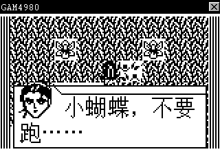

# BBK 9288 GAM4980 Player

[](https://github.com/HelloClyde/bbk9288-gam4980-player/actions/workflows/validate-9288.yml)
[](COPYING)

将 A 系列 GAM4980 模拟器移植到 BBK 9288。程序使用 9288 原生 KF2 格式和
9288 SDK，并已在
[`bbk9288-emulator`](https://github.com/HelloClyde/bbk9288-emulator) 中验证
《伏魔记》的文件选择、启动、主菜单和开场剧情。

## 游戏截图



> 截图仅展示兼容性；仓库与发布包均不包含《伏魔记》或其他 `.gam` 游戏文件。

## 快速开始

1. 从 [Releases](https://github.com/HelloClyde/bbk9288-gam4980-player/releases/latest)
   下载 `bbk9288-gam4980-player.zip`。
2. 解压后保持目录结构，把 `系统` 和 `gam4980` 两个目录复制到 9288 的
   `A:\` 根目录。
3. 将自己有权使用的 `.gam` 游戏文件复制到 `A:\gam4980\`。
4. 在 9288 的“娱乐”分类中运行 `GAM4980`，然后从文件选择界面打开游戏。

安装完成后的主要文件如下：

```text
A:\系统\程序\GAM4980.exe
A:\gam4980\8.BIN
A:\gam4980\E.BIN
A:\gam4980\你的游戏.gam
```

## 功能

- 9288 的 320×240 屏幕上，将 159×96 游戏 LCD 精确放大两倍为 318×192，
  显示在 `(1, 24)`，不裁切、不插值。
- 直接把 1 bpp 游戏画面转换到 9288 的 320×240、2 bpp 离屏画面，再通过
  GUI 整帧接口显示。
- 应用安装在“娱乐”分类，使用带 9288 原生圆角投影框的 40×40、16×16
  四级灰度图标。
- 每次启动都显示 `.gam` 文件选择界面，即使目录中只有一个游戏；界面只使用
  9288 SDK 的窗口、绘图、字体和键盘 API。
- 支持完整 9288 键盘，包括方向键、数字、QWERTY、翻页键和功能键。
- `.sav` 与 `.gam` 位于同一目录并使用相同主文件名；正常退出时写回变化。
- 两片 2 MiB ROM 使用 4 KiB bank 缓存，Flash 按游戏实际大小分配，适配
  9288 的 8 MiB SDRAM。
- 使用 9288 原生 GUI `MSG_TIMER`（ID 1、speed 20）驱动主循环，并按
  实测约 20 Hz 的消息频率，每次推进 3 个 60 Hz 客机帧。
- 仿照 9288 版《雷霆战机》，以 `SysBltFrame` 后接 `InvalidateRect` 的顺序
  提交离屏画面，不直接写显存。
- 6502 解释器默认使用 computed-goto 和直接栈访问；在 9288 模拟器中，
  修正 Timer 相位换算后《伏魔记》实测约 58 帧/秒。
- 9288 正式构建默认使用 `-O2`，让编译器内联解释器的指令读取热路径；相比
  先前偏向模拟器表现的 `-Os` 构建，EXE 约增加 11 KiB，不增加运行时内存。
- 工具链补丁会识别 computed-goto 形成的大型间接跳转状态机，避免把数百个
  立即数提升成贯穿整个解释器的长生命周期寄存器；当前 `s6502_exec` 的栈帧
  从 34 个字缩到 12 个字，静态栈读取点从 1222 个降到 598 个。
- 在同一台主机上用《伏魔记》连续运行 100,000 个客机帧、取三次中位数，
  当前核心吞吐约为 v1.2 正式 `-Os` 构建的 2.3 倍；该数字不包含 9288 固件
  整屏传输和 GUI 开销，不能直接等同于真机显示帧率。
- 2× 屏幕输出把位展开、水平对齐和双行复制合并成一次查表循环；在输出逐字节
  一致的主机微基准中，应用侧画面预处理约为旧实现的 4.2 倍，同时仍保持
  20 fps GUI 提交频率和 `SysBltFrame` 真机兼容路径。查表占用 2 KiB 静态
  scratch，不消耗堆内存。

## 仓库结构

```text
assets/9288/                 9288 四级灰度图标源文件和设备资源
src/gam4980_9288*.c         9288 窗口、运行时和启动代码
src/gam4980_core.*          GAM4980 模拟核心
src/s6502.c                 6502 解释器
tests/                      核心、模拟器和 2× 几何验证
toolchain/                  9288 GNU33 ABI 的 S1C33 LLVM 补丁
应用/数据/游戏/gam4980/    运行所需的 8.BIN 和 E.BIN
```

旧 9588 前端和打包脚本不属于本仓库；上游实现仍可在
[`gam4980-player-for9588`](https://github.com/HelloClyde/gam4980-player-for9588)
获取。

本次移植中的 SDK/ABI、内存、KF2、GUI 刷屏、Timer、输入和真机验证经验
已整理到 [`docs/9288-porting-lessons.md`](docs/9288-porting-lessons.md)。

## 安装

把发布包中的文件复制到 9288 的 `A:\`：

```text
A:\系统\程序\GAM4980.exe
A:\gam4980\8.BIN
A:\gam4980\E.BIN
A:\gam4980\你的游戏.gam
```

仓库和发布 ZIP 均包含运行所需的 `8.BIN`、`E.BIN`，但不包含游戏文件。
请自行复制有权使用的 `.gam`。

## 构建

### 1. 准备 9288 SDK

取得 `app_env_9288`，将其放在仓库的 `sdk/`，或构建时通过 `--sdk` 指定路径。
`sdk/` 被 Git 忽略，构建不会读取 9588 SDK。

### 2. 准备 GNU33 ABI 工具链

开源 S1C33 LLVM 后端的默认 ABI 与 9288 固件不同。9288 使用 R6–R9 传递前
四个参数、R4 返回，并由加载器保留 R15。本项目补丁还修正大型直接线程解释器
中的立即数提升导致的寄存器压力。下面的 WSL/Linux 示例固定到本项目验证过的
工具链提交：

```bash
git clone https://github.com/autch/piece-toolchain-llvm.git
cd piece-toolchain-llvm
git checkout afd7c6bdac84314c30da4609eb7a2a47cc3ad3a0
git submodule update --init llvm
git -C llvm apply /path/to/bbk9288-gam4980-player/toolchain/9288-gnu33-abi.patch

cmake -G Ninja -S llvm/llvm -B build \
  -DCMAKE_BUILD_TYPE=Release \
  -DLLVM_TARGETS_TO_BUILD= \
  -DLLVM_EXPERIMENTAL_TARGETS_TO_BUILD=S1C33 \
  -DLLVM_DEFAULT_TARGET_TRIPLE=s1c33-none-elf \
  -DLLVM_ENABLE_PROJECTS='clang;lld' \
  -DLLVM_INCLUDE_TESTS=OFF \
  -DLLVM_INCLUDE_EXAMPLES=OFF \
  -DLLVM_INCLUDE_BENCHMARKS=OFF \
  -DLLVM_PARALLEL_LINK_JOBS=1
ninja -C build clang lld llvm-objcopy llvm-readelf
```

### 3. 构建 KF2 和发布 ZIP

```bash
python3 build_9288.py \
  --sdk /path/to/app_env_9288 \
  --toolchain /path/to/piece-toolchain-llvm/build/bin
python3 package_release_9288.py
```

输出：

```text
build/9288/GAM4980.exe
build/bbk9288-gam4980-player.zip
```

`build_9288.py` 会规范化旧 SDK 头文件中的 Windows 路径和大小写，构建
freestanding S1C33 ELF，再封装 KF2 头和图标。`package_release_9288.py` 会
校验 KF2 布局、分类、图标、ROM 大小和 SHA-256，并生成可重复的 ZIP。

如需排查编译器兼容性，可向 `build_9288.py` 传入 `--switch-dispatch`，使用
较慢但可移植的 `switch` 分派。

## 图标

最终源图是 `assets/9288/gam4980-icon-imagegen-v3.png`。修改后可重新生成设备
资源：

```bash
python3 -m pip install Pillow
python3 tools/convert_9288_icon.py \
  --frame-root /path/to/app_env_9288/apmk
```

## 操作

- 方向键：游戏方向键
- Enter：游戏 Enter
- Backspace：游戏 Delete
- Tab：游戏 Input
- Space、Shift、0–9、A–Z：对应原机按键
- Page Up / Page Down：对应原机翻页键
- F1–F12：Speak、CE、汉英、双解、Power、Menu、Modify、Shift、Search、
  Download、Help、Exit
- 短按 Esc 或 F12：发送游戏 Exit
- 长按 Esc 或 F12 一秒：关闭 9288 应用

## 验证

6502 ADC/SBC 算术与寻址回归测试：

```bash
gcc -std=gnu11 -O2 -Wall -Wextra -Werror -Isrc \
  tests/s6502_arithmetic_test.c -o build/s6502_arithmetic_test
./build/s6502_arithmetic_test
```

桌面核心冒烟测试：

```bash
gcc -std=gnu11 -O2 -Wall -Wextra -Werror \
  -Wno-unused-parameter -DDL_DOWN -D_RLS_ -Isrc \
  tests/core_smoke.c src/gam4980_core.c -o build/core_smoke
./build/core_smoke \
  应用/数据/游戏/gam4980/8.BIN \
  应用/数据/游戏/gam4980/E.BIN \
  /path/to/test.gam
```

模拟器验证时先复制原始 NAND，再用增量安装脚本写入应用、ROM 和自备游戏。
脚本会保留 `kernel.bin`，不要把唯一的原始 NAND 作为输出：

```bash
python3 tests/prepare_emulator_nand.py \
  --image-tool /path/to/emulator/scripts/bbk9288s_nand_image.py \
  --base /path/to/emulator/runtime/nand-user.raw \
  --source build/emulator-staging \
  --output /path/to/emulator/runtime/gam4980-test.raw \
  --flat build/gam4980-test-flat.img
```

以 QMP 端口 4444 启动模拟器后：

```bash
python3 tests/emulator_qmp_smoke.py --output build/emulator-smoke
python3 tests/check_2x_frame.py build/emulator-smoke/05-story-dialog.ppm
```

冒烟脚本会进入“娱乐”、启动 GAM4980，并走到《伏魔记》开场剧情。几何检查
要求每个源像素精确对应一个 2×2 像素块，客户区左右和底部边距保持白色。

## 上游与许可

模拟器核心源自：

- [无云 / BBK-simulator](https://gitee.com/BA4988/BBK-simulator/tree/BA4988/BA4988)
- [iyzsong / gam4980](https://codeberg.org/iyzsong/gam4980)

源代码采用 GPLv3，详见 [`COPYING`](COPYING)。仓库中的 `8.BIN`、`E.BIN`
随项目提供，但不属于 GPLv3 源码许可范围。9288 SDK、固件、NAND、游戏和
第三方工具链不包含在本许可中。
